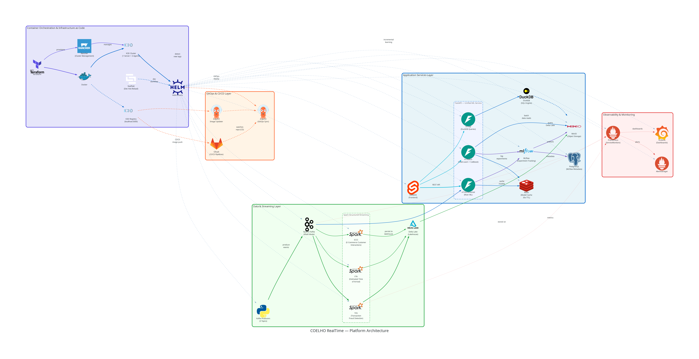

<div align="center">


# COELHO RealTime

**Production-Grade Real-Time MLOps Platform**

A Kubernetes-native Machine Learning Operations platform demonstrating three concurrent ML use cases
with incremental learning (River), batch learning (CatBoost/Scikit-Learn), and full-stack observability.

[](https://www.python.org/)
[](https://fastapi.tiangolo.com/)
[](https://kit.svelte.dev/)
[](https://www.typescriptlang.org/)
[](https://k3d.io/)
[](https://helm.sh/)
[](https://kafka.apache.org/)
[](https://mlflow.org/)
[](https://prometheus.io/)
[](https://grafana.com/)
[](https://argoproj.github.io/cd/)
[](LICENSE)

</div>

---

## Table of Contents

- [Overview](#overview)
- [Architecture](#architecture)
- [ML Use Cases](#ml-use-cases)
- [Tech Stack](#tech-stack)
- [Key Components](#key-components)
- [Prerequisites](#prerequisites)
- [Infrastructure Specifications](#infrastructure-specifications)
- [Getting Started](#getting-started)
- [Service Access](#service-access)
- [API Reference](#api-reference)
- [Monitoring & Observability](#monitoring--observability)
- [CI/CD & GitOps](#cicd--gitops)
- [Project Structure](#project-structure)
- [Precursor Project](#precursor-project)

---

## Overview

COELHO RealTime is an end-to-end MLOps platform built on Kubernetes that demonstrates production-grade machine learning workflows. The platform runs three concurrent ML projects with dual learning paradigms:

- **Incremental Learning** via [River](https://riverml.xyz/) — models learn from each data point in real time as it streams through Kafka
- **Batch Learning** via [CatBoost](https://catboost.ai/) and [Scikit-Learn](https://scikit-learn.org/) — models trained on accumulated data in Delta Lake with full experiment tracking

Data flows from Kafka Producers through Kafka topics into a unified FastAPI backend, which handles both real-time inference and batch training. All experiments are tracked in MLflow with artifacts stored in MinIO (S3-compatible). A SvelteKit frontend provides interactive dashboards for each ML project, and the entire system is monitored through Prometheus and Grafana with 10+ custom dashboards and 30+ alerting rules.

---

## Architecture

<div align="center">

</div>

```
+-----------------------------------------------------------------------+
|                         k3d Kubernetes Cluster                        |
+-----------------------------------------------------------------------+
|                                                                       |
|  +------------+                        +----------+    +----------+   |
|  | SvelteKit  |<---------------------->|  Kafka   |<-->| Producers|   |
|  | Frontend   |                        | (KRaft)  |    | (Python) |   |
|  |   :5173    |                        +----+-----+    +----------+   |
|  +------+-----+                             |                         |
|         |                                   |                         |
|         |         +-------------------+     |                         |
|         +-------->|    FastAPI         |     |                         |
|                   |  (Unified ML)     |     |                         |
|                   |     :8000         |     |                         |
|                   | /api/v1/incremental|    |                         |
|                   | /api/v1/batch     |     |                         |
|                   | /api/v1/sql       |     |                         |
|                   +--------+----------+     |                         |
|                            |                |                         |
|                            v                v                         |
|         +----------+   +----------+   +----------+                    |
|         |  MLflow  |<->|PostgreSQL|   |  MinIO   |                    |
|         |  :5000   |   |(metadata)|   |(artifacts)|                   |
|         +----------+   +----------+   +----+-----+                    |
|                                            |                          |
|                    +----------+            v                          |
|                    |  Spark   |       +----------+                    |
|                    | Master   |       | Delta    |                    |
|                    |  :4040   |       | Lake     |                    |
|                    +----+-----+       +----------+                    |
|                         |                                             |
|                    +----+-----+                                       |
|                    |  Spark   |                                       |
|                    | Worker   |                                       |
|                    +----------+                                       |
|                                                                       |
|  +----------+   +----------+   +----------+   +----------+           |
|  |Prometheus|<->| Grafana  |<->|Alertmgr  |   |  Redis   |           |
|  |  :9090   |   |  :3000   |   |  :9094   |   | (cache)  |           |
|  +----------+   +----------+   +----------+   +----------+           |
|                                                                       |
+-----------------------------------------------------------------------+
```

### Data Flow

1. **Generation** — Kafka Producers generate realistic synthetic data for 3 concurrent use cases using [Faker](https://faker.readthedocs.io/)
2. **Streaming** — Data lands in Kafka topics (KRaft mode, 3 partitions each, 1-week retention)
3. **Incremental Processing** — FastAPI consumers read Kafka streams and train River models in real time
4. **Batch Processing** — Spark Structured Streaming writes to Delta Lake on MinIO; DuckDB preprocesses data for CatBoost/Sklearn training
5. **Inference** — Trained models cached in Redis for sub-millisecond predictions
6. **Tracking** — All experiments logged to MLflow with S3 artifacts on MinIO
7. **Monitoring** — Prometheus scrapes metrics from all services; Grafana renders dashboards; Alertmanager fires alerts

---

## ML Use Cases

### 1. Transaction Fraud Detection (TFD)

| Property | Value |
|---|---|
| **Task** | Binary Classification |
| **Incremental Model** | Adaptive Random Forest Classifier (River) |
| **Batch Model** | CatBoostClassifier |
| **Primary Metric** | F-Beta Score (beta=2.0) |
| **Features** | 16 (amount, merchant_id, payment_method, device_type, location, etc.) |
| **Kafka Topic** | `transaction_fraud_detection` |

### 2. Estimated Time of Arrival (ETA)

| Property | Value |
|---|---|
| **Task** | Regression |
| **Incremental Model** | Adaptive Random Forest Regressor (River) |
| **Batch Model** | CatBoostRegressor |
| **Primary Metric** | MAE (Mean Absolute Error) |
| **Features** | 12 (distance, weather, temperature, traffic, driver_rating, etc.) |
| **Kafka Topic** | `estimated_time_of_arrival` |

### 3. E-Commerce Customer Interactions (ECCI)

| Property | Value |
|---|---|
| **Task** | Clustering |
| **Incremental Model** | DBSTREAM (River) |
| **Batch Model** | KMeans (Scikit-Learn) |
| **Primary Metric** | Silhouette Score |
| **Features** | 9 (event_type, product_category, price, device_type, browser, etc.) |
| **Kafka Topic** | `e_commerce_customer_interactions` |

---

## Tech Stack

### Backend & ML

| Technology | Purpose |
|---|---|
| **FastAPI** | Unified REST API (39 endpoints across 3 versioned routers) |
| **River** | Online/incremental machine learning |
| **CatBoost** | Gradient boosting for batch classification and regression |
| **Scikit-Learn** | Batch ML pipelines, KMeans clustering |
| **MLflow** | Experiment tracking, model versioning, artifact storage |
| **DuckDB** | SQL queries on Delta Lake (5-10x faster than Pandas) |
| **Polars / Pandas / PyArrow** | Data processing |
| **YellowBrick / Scikit-Plot** | ML model visualizations |
| **Redis** | Live model caching for real-time predictions (30s TTL) |
| **orjson** | High-performance JSON serialization (3-5x faster than stdlib) |
| **uv** | Fast Python package manager (10-100x faster than pip) |

### Frontend

| Technology | Purpose |
|---|---|
| **SvelteKit 2.20+** | Modern SSR/SSG web framework |
| **TypeScript 5.5+** | Type-safe frontend development |
| **Tailwind CSS 4.0** | Utility-first styling |
| **Plotly.js** | Interactive data visualizations |
| **Bits UI** | Accessible UI component library |
| **Lucide Svelte** | Icon library |

### Infrastructure & DevOps

| Technology | Purpose |
|---|---|
| **Kubernetes (k3d/k3s)** | Container orchestration |
| **Helm 3** | Kubernetes package management (7 chart dependencies) |
| **Skaffold** | Local development with hot-reload |
| **ArgoCD** | GitOps continuous delivery |
| **ArgoCD Image Updater** | Automatic image tag updates |
| **GitLab CI** | CI/CD pipeline (Docker-in-Docker builds) |
| **Terraform** | Infrastructure-as-Code (cluster provisioning) |

### Data & Messaging

| Technology | Purpose |
|---|---|
| **Apache Kafka (KRaft)** | Real-time event streaming (no Zookeeper) |
| **Apache Spark** | Structured Streaming to Delta Lake |
| **Delta Lake** | ACID-compliant lakehouse storage on MinIO |
| **MinIO** | S3-compatible object storage |
| **PostgreSQL** | MLflow metadata backend |

### Observability

| Technology | Purpose |
|---|---|
| **Prometheus** | Metrics collection and alerting rules |
| **Grafana** | 10+ custom dashboards |
| **Alertmanager** | Alert routing, inhibition, and notifications |
| **Karma** | Alertmanager dashboard UI |

---

## Key Components

### Unified FastAPI Backend

A single service at port 8000 consolidates all ML functionality into three versioned routers:

- **`/api/v1/incremental`** — River ML real-time training, predictions, and metrics (16 endpoints)
- **`/api/v1/batch`** — CatBoost/Sklearn batch training, YellowBrick/Scikit-Plot visualizations (20 endpoints)
- **`/api/v1/sql`** — DuckDB SQL queries against Delta Lake tables (3 endpoints)

Features include MLflow model selection (best model by metric), Redis caching, Prometheus instrumentation, and YellowBrick/Scikit-Plot visualization generation.

### Kafka Producers

Three independent Python producers generate realistic synthetic data with:

- Retry logic and metadata readiness checks
- Custom Prometheus metrics (messages_sent, errors, send_duration, fraud_ratio, active_sessions)
- Graceful shutdown handling
- orjson serialization for performance

### SvelteKit Frontend

A modern TypeScript frontend with:

- Project pages for TFD, ETA, and ECCI with nested tabs (Incremental ML / Batch ML / SQL)
- Interactive Plotly.js visualizations
- Services dropdown (FastAPI, Spark, MLflow, MinIO, Prometheus, Grafana, Alertmanager, Kafka)
- Modular component architecture with Svelte stores for state management

### Helm Chart

A single umbrella chart with 7 dependencies:

| Dependency | Version | Source |
|---|---|---|
| MLflow | 1.8.1 | community-charts |
| Redis | 24.0.8 | Bitnami |
| MinIO | 5.4.0 | MinIO Official |
| PostgreSQL | 18.1.14 | Bitnami |
| kube-prometheus-stack | 80.6.0 | prometheus-community |
| Kafka | 32.4.3 | Bitnami |
| Spark | 10.0.3 | Bitnami |

---

## Prerequisites

| Tool | Minimum Version | Purpose |
|---|---|---|
| **Docker** | 20.10+ | Container runtime |
| **docker-buildx** | latest | BuildKit-based builds (required by Skaffold) |
| **Terraform** | 1.6+ | Infrastructure-as-Code (cluster provisioning) |
| **k3d** | 5.0+ | Local Kubernetes cluster |
| **kubectl** | 1.28+ | Kubernetes CLI |
| **Helm** | 3.12+ | Chart management |
| **Skaffold** | latest | Local development workflow (optional — see Helm-only method) |
| **Git** | latest | Version control |

---

## Infrastructure Specifications

> **Minimum 32GB RAM required.** This platform runs multiple memory-intensive services concurrently (FastAPI with 8GB limit, Spark workers with 5GB limit, Kafka with 2GB limit, Prometheus with 2GB limit, etc.). Systems with less than 32GB will experience OOMKills and pod restart loops.

### Development Environment

| Component | Specification |
|---|---|
| **OS** | Arch Linux (any Linux distribution supported) |
| **RAM** | 64GB |
| **Processor** | Intel Core i7 11th Generation |
| **CPU Cores** | 8 |
| **Storage** | 2TB SSD NVMe |

### Kubernetes Resource Allocation

The table below shows the memory requests and limits configured for each service. All services run concurrently in the same k3d cluster.

| Service | Memory Request | Memory Limit | CPU Request | CPU Limit |
|---|---|---|---|---|
| **FastAPI** (Unified ML API) | 4Gi | 8Gi | 1000m | 2000m |
| **Spark Worker** (x1) | 2Gi | 5Gi | 1000m | 2000m |
| **Spark Master** | 1Gi | 2Gi | 500m | 1000m |
| **Kafka** (KRaft controller) | 1Gi | 2Gi | 500m | 1000m |
| **Prometheus** | 512Mi | 2Gi | 200m | 1000m |
| **SvelteKit** (Frontend) | 1Gi | 2Gi | 250m | 500m |
| **MLflow** | 512Mi | 1Gi | 250m | 500m |
| **Redis** | 256Mi | 512Mi | 100m | 250m |
| **MinIO** | 256Mi | 512Mi | 100m | — |
| **PostgreSQL** | 256Mi | 512Mi | 100m | 500m |
| **Grafana** | 256Mi | 512Mi | 100m | 500m |
| **Kafka Producers** | 256Mi | 512Mi | 100m | 250m |
| **Prometheus Operator** | 128Mi | 256Mi | 100m | 200m |
| **Alertmanager** | 64Mi | 128Mi | 50m | 100m |
| **Karma** | 64Mi | 128Mi | 50m | 100m |
| **Redis Metrics Exporter** | 64Mi | 128Mi | 50m | 100m |
| **PostgreSQL Metrics Exporter** | 64Mi | 128Mi | 50m | 100m |
| **Node Exporter** | 32Mi | 64Mi | 50m | 100m |
| **Total (approximate)** | **~12Gi** | **~26Gi** | **~4.5 cores** | **~10 cores** |

### Minimum Hardware Requirements

| Tier | RAM | CPU Cores | Notes |
|---|---|---|---|
| **Minimum** | 32GB | 8 | Services may hit memory limits under heavy load |
| **Recommended** | 64GB | 8+ | Comfortable headroom for all services plus OS and Docker overhead |

The k3d cluster itself, Docker daemon, and host OS require additional memory beyond what is allocated to Kubernetes pods. With 32GB, expect ~6GB for the host and Docker, leaving ~26GB for Kubernetes — enough to run all services at their configured limits. With 64GB, there is ample headroom for peak workloads, multiple training jobs, and Spark processing.

---

## Getting Started

### 1. Clone the Repository

```bash
git clone https://github.com/rafaelcoelho1409/COELHORealTime.git
cd COELHORealTime
```

### 2. Create the k3d Cluster with Terraform

The cluster is provisioned via Terraform, which creates a k3d cluster with a built-in Docker registry, persistent volume mounts, and optional Rancher dashboard.

```bash
cd k3d/terraform
terraform init
terraform apply -target=module.k3d_cluster -auto-approve
terraform apply -auto-approve
```

The two-stage apply ensures the cluster API is ready before deploying additional modules (e.g., Rancher). After completion, your kubectl context is automatically set to `k3d-coelho-realtime`.

### 3. Update Helm Dependencies

```bash
cd ../helm
helm dependency update
cd ../..
```

### 4. Deploy the Application

Choose one of the two deployment methods below:

#### Option A: Skaffold (Development — recommended)

```bash
skaffold dev -p dev
```

Skaffold builds all three Docker images, pushes them to the k3d registry, deploys the Helm chart, and sets up port forwarding with hot-reload for Python and Svelte source files. Code changes are synced into running containers automatically.

#### Option B: Helm (Manual)

Build and push the images to the k3d registry manually, then install the chart:

```bash
# Build and push images to k3d registry
docker build -t localhost:5000/coelho-realtime-fastapi:latest ./apps/fastapi -f ./apps/fastapi/Dockerfile.fastapi
docker push localhost:5000/coelho-realtime-fastapi:latest

docker build -t localhost:5000/coelho-realtime-kafka-producers:latest ./apps/kafka-producers -f ./apps/kafka-producers/Dockerfile.kafka-producers
docker push localhost:5000/coelho-realtime-kafka-producers:latest

docker build -t localhost:5000/coelho-realtime-sveltekit:latest ./apps/sveltekit -f ./apps/sveltekit/Dockerfile.sveltekit
docker push localhost:5000/coelho-realtime-sveltekit:latest

# Install the Helm chart
helm upgrade --install coelho-realtime ./k3d/helm \
  --namespace coelho-realtime \
  --create-namespace \
  --set 'fastapi.image=localhost:5000/coelho-realtime-fastapi:latest' \
  --set 'kafka-producers.image=localhost:5000/coelho-realtime-kafka-producers:latest' \
  --set 'sveltekit.image=localhost:5000/coelho-realtime-sveltekit:latest'
```

To access services without Skaffold's automatic port forwarding, set up port forwards manually:

```bash
# Core application
kubectl port-forward -n coelho-realtime svc/coelho-realtime-fastapi 8000:8000 &
kubectl port-forward -n coelho-realtime svc/coelho-realtime-sveltekit 5173:5173 &

# ML & Data
kubectl port-forward -n coelho-realtime svc/coelho-realtime-mlflow 5001:5000 &
kubectl port-forward -n coelho-realtime svc/coelho-realtime-minio 9000:9000 &
kubectl port-forward -n coelho-realtime svc/coelho-realtime-minio-console 9001:9001 &
kubectl port-forward -n coelho-realtime svc/coelho-realtime-spark-master-svc 4040:80 &

# Monitoring
kubectl port-forward -n coelho-realtime svc/coelho-realtime-kube-prome-prometheus 9090:9090 &
kubectl port-forward -n coelho-realtime svc/coelho-realtime-grafana 3000:3000 &
kubectl port-forward -n coelho-realtime svc/coelho-realtime-kube-prome-alertmanager 9094:9094 &
kubectl port-forward -n coelho-realtime svc/coelho-realtime-karma 8088:8088 &
kubectl port-forward -n coelho-realtime svc/coelho-realtime-kafka 9092:9092 &
```

To rebuild and redeploy after code changes:

```bash
# Rebuild the changed image (e.g., FastAPI)
docker build -t localhost:5000/coelho-realtime-fastapi:latest ./apps/fastapi -f ./apps/fastapi/Dockerfile.fastapi
docker push localhost:5000/coelho-realtime-fastapi:latest

# Restart the deployment to pick up the new image
kubectl rollout restart deployment/coelho-realtime-fastapi -n coelho-realtime
```

### 5. Verify Deployment

```bash
kubectl get pods -n coelho-realtime
```

All services should reach `Running` status. Kafka Producers will begin generating data immediately, and River models will start incremental training as data flows in.

---

## Service Access

Once deployed, services are accessible at the following ports:

| Service | URL | Description |
|---|---|---|
| **SvelteKit** | http://localhost:5173 | Web frontend |
| **FastAPI** | http://localhost:8000 | Unified ML API |
| **FastAPI Docs** | http://localhost:8000/docs | Swagger UI |
| **MLflow** | http://localhost:5001 | Experiment tracking |
| **MinIO Console** | http://localhost:9001 | S3 storage browser |
| **Spark Master** | http://localhost:4040 | Spark jobs UI |
| **Prometheus** | http://localhost:9090 | Metrics & queries |
| **Grafana** | http://localhost:3000 | Dashboards |
| **Alertmanager** | http://localhost:9094 | Alert management |
| **Karma** | http://localhost:8088 | Alertmanager dashboard |
| **Kafka** | localhost:9092 | Message broker |

---

## API Reference

**Base URL:** `http://localhost:8000`

### Incremental ML — `/api/v1/incremental`

| Method | Endpoint | Description |
|---|---|---|
| `POST` | `/train` | Start River training from best MLflow model |
| `POST` | `/predict` | Real-time prediction using cached model |
| `GET` | `/metrics/{project}` | Training metrics history |
| `GET` | `/sample/{project}` | Sample training data |
| `GET` | `/health` | Health check |

### Batch ML — `/api/v1/batch`

| Method | Endpoint | Description |
|---|---|---|
| `POST` | `/train` | Start CatBoost/Sklearn training |
| `POST` | `/predict` | Batch prediction |
| `GET` | `/visualizations/{project}/{type}` | YellowBrick/Scikit-Plot visualizations |
| `GET` | `/training-status` | Training progress |
| `GET` | `/mlflow-runs` | MLflow experiment history |

### SQL Analytics — `/api/v1/sql`

| Method | Endpoint | Description |
|---|---|---|
| `POST` | `/query` | Execute DuckDB SQL on Delta Lake |
| `GET` | `/table-schema/{project}` | Inspect table schema |
| `GET` | `/total-rows` | Row counts per table |

### System

| Method | Endpoint | Description |
|---|---|---|
| `GET` | `/` | API info |
| `GET` | `/health` | Health check |
| `GET` | `/metrics` | Prometheus metrics |

---

## Monitoring & Observability

### Prometheus Metrics

Custom metrics are instrumented across all services:

**FastAPI** — Training status, prediction count/latency/errors, cache hits/misses, model loading duration, MLflow operation duration, SQL query duration, visualization generation time

**Kafka Producers** — Messages sent, errors, send duration, connection status, retries, fraud ratio (TFD), active sessions (ECCI)

### Grafana Dashboards (10+)

All dashboards are provisioned via ConfigMaps with sidecar auto-discovery:

1. **COELHORealTime Overview** — Service health, total CPU/RAM aggregate panels with sparklines
2. **ML Pipeline** — Training metrics, predictions, model performance
3. **FastAPI Detailed** — Request latency, error rates, throughput per endpoint
4. **Kafka Producers** — Message rates, send latency, errors, connections
5. **Kafka** — Consumer lag, throughput, partitions
6. **PostgreSQL** — Connections, queries, replication
7. **Redis** — Memory, connections, ops/sec
8. **MinIO** — S3 operations, storage, buckets
9. **Spark** — Performance metrics
10. **Spark Streaming** — Structured streaming metrics

### Alerting

- **30+ Prometheus alerting rules** across 10 rule groups (FastAPI, Kafka, Kafka Producers, MLflow, PostgreSQL, Redis, MinIO, SvelteKit, Spark, Application General)
- **Alertmanager** with routing and inhibition rules
- **Karma** UI for alert visualization
- Pre-configured receivers for Slack, Discord, Email, and PagerDuty (uncomment in values.yaml to activate)

---

## CI/CD & GitOps

### GitLab CI Pipeline

The CI pipeline triggers on pushes to `master` and builds three Docker images:

```
coelho-realtime-fastapi
coelho-realtime-kafka-producers
coelho-realtime-sveltekit
```

Images are tagged with both `commit SHA` and `latest`, then pushed to the k3d built-in registry.

### GitOps Workflow

```
Developer Push → GitLab CI Builds Images → Push to Registry
                                                  ↓
ArgoCD Auto-Sync ← Git Commit [skip ci] ← ArgoCD Image Updater Detects New Tags
         ↓
   Deploy to Cluster → Prometheus Monitors → Grafana Dashboards → Alertmanager
```

ArgoCD Image Updater watches the registry for new `:latest` tags, updates `k3d/helm/values.yaml` with the new image references, and commits back to Git. ArgoCD then detects the manifest change and auto-syncs the deployment.

---

## Project Structure

```
COELHORealTime/
├── apps/
│   ├── fastapi/                        # Unified ML API backend
│   │   ├── app.py                      # FastAPI application (port 8000)
│   │   ├── config.py                   # Centralized configuration
│   │   ├── metrics.py                  # Prometheus metrics registry
│   │   ├── routers/v1/
│   │   │   ├── incremental.py          # River ML endpoints
│   │   │   ├── batch.py               # CatBoost/Sklearn endpoints
│   │   │   └── sql.py                 # Delta Lake SQL endpoints
│   │   ├── ml_training/
│   │   │   ├── river/                 # Incremental training scripts
│   │   │   └── sklearn/               # Batch training scripts
│   │   ├── utils/
│   │   │   ├── incremental.py         # River ML helpers
│   │   │   └── batch.py              # YellowBrick visualizations
│   │   ├── Dockerfile.fastapi
│   │   └── pyproject.toml
│   │
│   ├── kafka-producers/                # Real-time data generators
│   │   ├── transaction_fraud_detection.py
│   │   ├── estimated_time_of_arrival.py
│   │   ├── e_commerce_customer_interactions.py
│   │   ├── metrics.py                 # Prometheus metrics
│   │   ├── metrics_server.py          # Metrics HTTP server
│   │   ├── Dockerfile.kafka-producers
│   │   └── pyproject.toml
│   │
│   └── sveltekit/                      # Modern frontend
│       ├── src/
│       │   ├── routes/                # TFD, ETA, ECCI pages
│       │   └── lib/
│       │       ├── api/               # API client modules
│       │       ├── components/        # Shared + project components
│       │       ├── stores/            # Svelte state stores
│       │       └── types/             # TypeScript definitions
│       ├── Dockerfile.sveltekit
│       └── package.json
│
├── k3d/
│   ├── helm/                           # Umbrella Helm chart
│   │   ├── Chart.yaml                 # 7 dependencies
│   │   ├── values.yaml                # Service configurations
│   │   └── templates/                 # K8s manifests, ConfigMaps, dashboards
│   ├── terraform/                      # IaC for cluster provisioning
│   └── argocd/
│       └── application.yaml           # ArgoCD Application CRD
│
├── data/
│   ├── postgresql/                     # MLflow metadata
│   └── minio/                         # S3 storage
│       ├── lakehouse/                 # Delta Lake tables
│       └── mlflow-artifacts/          # Model artifacts
│
├── diagrams/                           # Architecture diagrams (auto-generated)
├── docs/                               # 20+ documentation files
│
├── .gitlab-ci.yml                      # CI/CD pipeline
├── skaffold.yaml                       # Local dev configuration
├── .env                                # Environment variables
└── TODO.md                             # Project roadmap & status
```

---

## Precursor Project

This project builds upon the infrastructure patterns established in [**K3D**](https://github.com/rafaelcoelho1409/K3D) — a Terraform-based local Kubernetes cluster with integrated DevOps tooling (ArgoCD, GitLab, Rancher, LocalStack). COELHO RealTime extends that foundation with a full MLOps application layer, adding real-time machine learning, data streaming, experiment tracking, and production-grade observability.

---

<div align="center">

**[SvelteKit Frontend](http://localhost:5173)** | **[FastAPI Docs](http://localhost:8000/docs)** | **[MLflow UI](http://localhost:5001)** | **[Grafana](http://localhost:3000)** | **[Prometheus](http://localhost:9090)**

Built with Python 3.13 | Node 22+ | Kubernetes | Helm 3

</div>
